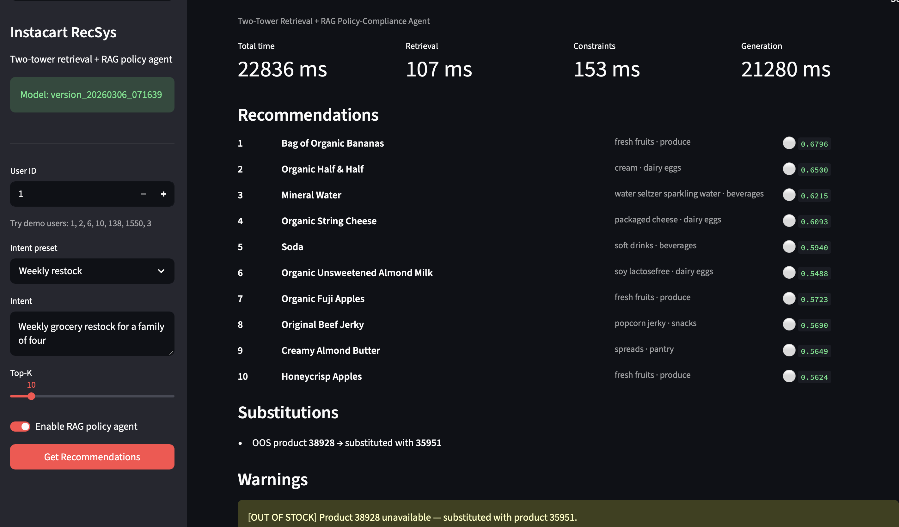

# Instacart Recommendation System

A production-grade grocery recommendation platform combining a **two-tower neural retriever**, a **LightGBM reranker**, and a **RAG-based policy-compliance agent** — built on the [Instacart Online Grocery dataset](https://www.kaggle.com/c/instacart-market-basket-analysis).

---

## Table of Contents

- [System Architecture](#system-architecture)
- [Stage 1 — Recommendation Engine](#stage-1--recommendation-engine)
- [Stage 2 — RAG Policy-Compliance Agent](#stage-2--rag-policy-compliance-agent)
- [End-to-End Pipeline Flow](#end-to-end-pipeline-flow)
- [Experiment Results](#experiment-results)
- [API & Streamlit UI](#api--streamlit-ui)
- [Project Structure](#project-structure)
- [Quick Start](#quick-start)
- [Key Design Decisions](#key-design-decisions)
- [Tech Stack](#tech-stack)

---

## System Architecture

```
┌─────────────────────────────────────────────────────────────────────────────┐
│                        INSTACART RECOMMENDATION SYSTEM                      │
│                                                                             │
│  ┌───────────────────────────────────────────────────────────────────────┐  │
│  │  STAGE 1 — RECOMMENDATION ENGINE                                      │  │
│  │                                                                       │  │
│  │  User ID ──► Two-Tower Model ──► FAISS ANN (top-200)                  │  │
│  │                                       │                               │  │
│  │                                       ▼                               │  │
│  │                                 LightGBM Reranker                     │  │
│  │                                 (6 features)                          │  │
│  │                                       │                               │  │
│  │                                       ▼                               │  │
│  │                                  Top-10 Recs                          │  │
│  └───────────────────────────────────┬───────────────────────────────────┘  │
│                                      │                                      │
│  ┌───────────────────────────────────▼───────────────────────────────────┐  │
│  │  STAGE 2 — RAG POLICY-COMPLIANCE AGENT (LangGraph)                    │  │
│  │                                                                       │  │
│  │  Recs + Intent ──► Inventory Constraints ──► Hybrid Policy Retrieval  │  │
│  │                    (stock, subs, warnings)   (FAISS + BM25 + RRF)     │  │
│  │                                                      │                │  │
│  │                                              Cohere Reranker          │  │
│  │                                                      │                │  │
│  │                                                      ▼                │  │
│  │                                              LLM Answer Gen           │  │
│  │                                              (GPT-4o + guardrails)    │  │
│  │                                                      │                │  │
│  │                                                      ▼                │  │
│  │                                              DeepEval Metrics         │  │
│  │                                              + MLflow Logging         │  │
│  └───────────────────────────────────────────────────────────────────────┘  │
└─────────────────────────────────────────────────────────────────────────────┘
```

---

## Stage 1 — Recommendation Engine

### Two-Tower Model

```
     ┌────────────────┐        ┌─────────────────────-┐
     │  USER TOWER    │        │    ITEM TOWER        │
     │                │        │                      │
     │  user_id       │        │  item_id             │
     │     │          │        │  aisle_id ──┐        │
     │  Embed(128)    │        │  dept_id  ──┤        │
     │     │          │        │             ▼        │
     │  Linear(128→256)        │  Embed concat        │
     │  ReLU          │        │  (128+32+16 = 176)   │
     │  Dropout(0.1)  │        │  Linear(176→256)     │
     │  Linear(256→128)        │  ReLU                │
     │     │          │        │  Dropout(0.1)        │
     │  L2-Norm       │        │  Linear(256→128)     │
     └───────┬────────┘        │  L2-Norm             │
             │                 └──────────┬───────────┘
             └────────────┬───────────────┘
                          ▼
               InfoNCE Loss (NT-Xent)
               · In-batch negatives
               · Hard negative mining
               · Popularity debiasing
```

**Training:** Temporal split (last order = test, second-to-last = val, rest = train). InfoNCE with temperature 0.07, hard negatives mined per-epoch on 25% user sample, popularity debiasing via `log(q_j)` correction.

### Retrieval → Reranking

| Stage | Model | Input | Output |
|-------|-------|-------|--------|
| **Retrieval** | Two-tower + FAISS `IndexFlatIP` | User ID | Top-200 candidates |
| **Reranking** | LightGBM + calibration | 6 features per candidate | Final top-10 |

**Reranker features:** similarity score, log(popularity), history flag, item reorder rate, log(user order count), log(user history size).

---

## Stage 2 — RAG Policy-Compliance Agent

The RAG agent takes the top-10 recommendations and validates them against 10 internal policy documents (substitutions, cold-chain, delivery windows, bulk limits, promotions, department-specific rules), then generates a structured, cited compliance report.

### Pipeline Nodes (LangGraph)

```
node_load_recs ──► node_apply_constraints ──► node_retrieve_policy ──► node_generate_answer
```

#### 2a. Inventory Constraints

- Applies real-time stock status (in-stock / low-stock / out-of-stock)
- Executes automatic substitutions from a candidate pool
- Emits warnings (low stock, out of stock, temperature conflicts)

#### 2b. Hybrid Policy Retrieval

```
Query (user intent + departments)
   ├── Dense: FAISS (text-embedding-3-small)  ──► top-80
   └── Sparse: BM25 (keyword-boosted)         ──► top-80
        └── Reciprocal Rank Fusion (RRF)      ──► top-30
             └── Cohere Reranker              ──► top-5
```

- **Index:** 10 policy Markdown files → 72 overlapping chunks (900 chars, 450 overlap)
- **Keyword boosting:** BM25 queries augmented with domain terms (promotion, substitution, organic, bulk, etc.)
- **Retrieval confidence threshold:** Low-confidence retrievals are flagged

#### 2c. LLM Answer Generation (GPT-4o)

The LLM receives retrieved policy chunks, inventory state, and recommendations, then produces structured JSON:

```json
{
  "user_id": "6",
  "recommended_items": [
    {
      "sku": "Organic Baby Spinach",
      "inventory_status": "in_stock",
      "reason": "Complies with organic produce handling standards.",
      "policy_citations": ["[dept_produce.md#1]"],
      "policy_notes": ""
    }
  ],
  "summary": "...",
  "errors": []
}
```

**Prompt guardrails:**

- No policy invention — every claim must trace to a `[source.md#N]` citation
- Inventory integrity — never upgrade stock status
- Scope constraints — only describe SKUs in the recommendation set
- Defensive defaults — unknown status → "unknown", uncovered risk → high risk
- Prompt-injection defense — retrieved documents treated as untrusted data

#### 2d. Evaluation

| Metric | Source | Range | Meaning |
|--------|--------|-------|---------|
| Faithfulness | DeepEval | 0–1 ↑ | Answer claims supported by retrieved chunks |
| Hallucination Rate | DeepEval | 0–1 ↓ | Fraction of unsupported claims |
| Retrieval Quality | DeepEval (Contextual Relevancy) | 0–1 ↑ | Retrieved chunks relevant to intent |
| Compliance Risk | DeepEval (GEval) | 0–1 ↓ | Inventory/policy violations |
| Context Recall | Derived | 0–1 ↑ | Coverage of relevant policy context |
| Context Precision | Derived | 0–1 ↑ | Precision of retrieved context |

All metrics, token counts, costs, and timings logged per-run to MLflow and `demo_outputs.jsonl`.

---

## End-to-End Pipeline Flow

```
                         ┌──────────────┐
                         │  User Query  │
                         │  (ID+Intent) │
                         └──────┬───────┘
                                │
                ┌───────────────▼────────────────┐
                │     Two-Tower Embedding Model  │
                │     FAISS ANN → top-200        │
                └───────────────┬────────────────┘
                                │
                ┌───────────────▼────────────────┐
                │     LightGBM Reranker          │
                │     6 features → top-10        │
                └───────────────┬────────────────┘
                                │
                ┌───────────────▼────────────────┐
                │     Inventory Constraints      │
                │     stock · substitutions      │
                └───────────────┬────────────────┘
                                │
                ┌───────────────▼────────────────┐
                │     Hybrid Policy Retrieval    │
                │     FAISS + BM25 → RRF → Cohere│
                └───────────────┬────────────────┘
                                │
                ┌───────────────▼────────────────┐
                │     LLM Answer Generation      │
                │     GPT-4o + guardrails        │
                └───────────────┬────────────────┘
                                │
                ┌───────────────▼────────────────┐
                │     DeepEval Metrics           │
                │     + MLflow Logging           │
                └───────────────┬────────────────┘
                                │
                                ▼
                    Structured JSON Output
                    (recs, citations, errors)
```

---

## Experiment Results

### Recommendation Model


| Experiment | Recall@10 | NDCG@10 | Recall@20 | NDCG@20 | Lift |
|-------------|-----------|-----------|-----------|-----------|-----------|
| **Popularity baseline** | 0.0699 | 0.0976 | 0.0955 | 0.0974 | — |
| **Two-Tower retrieval (user/item embeddings + dot-product similarity)** | 0.1065 | 0.1047 | 0.1427 | 0.1140 | +52.4% |
| **GBM reranker (gradient boosted trees, negative sampling, 3 ranking features, top-20 candidates)** | 0.1369 | 0.1423 | 0.1427 | 0.1326 | +95.9% |
| **Two-Tower retrieval + content embeddings (aisle + department features, MLP towers)** | 0.1451 | 0.1742 | 0.2073 | 0.1854 | +107.6% |
| **GBM reranker with expanded feature set (6 ranking features, top-200 candidate reranking)** | 0.1819 | 0.2315 | 0.2073 | 0.2179 | +160.2% |
| **LightGBM Learning-to-Rank reranker (LambdaRank objective)** | 0.2160 | 0.2543 | 0.2850 | 0.2639 | +209.0% |
| **Deep Two-Tower v2 + LambdaRank reranker (3-layer MLPs, GELU, LayerNorm, residual connections, 35% hard-neg mining)** | **0.2400** | **0.2751** | **0.3268** | **0.2919** | **★ +243.3%** |

All results are reported on a held-out test set of 206,209 users.

### What Drove Each Gain

| Category | Change | Impact |
|----------|--------|--------|
| **Architecture** | MLP towers (128→256→128), aisle/dept embeddings, Kaiming init | Non-linear projection, content-aware embeddings, stable training |
| **Training** | Hard negative mining, popularity debiasing, temporal validation, patience 4 | Better separation, unbiased loss, no future leakage |
| **Retrieval** | Candidate pool 20→200, FAISS-only, dynamic `emb_dim` from checkpoint | Higher recall ceiling, reliable ANN, config-free inference |
| **Reranker** | 3→6 features (reorder rate, user stats), train on val / eval on test | Stronger intent signal, no label leakage |
| **Architecture v2** | 2→3-layer MLP towers, ReLU→GELU activation, added LayerNorm after each linear layer | Smoother gradients, deeper non-linear projection, stable training with hard negatives |
| **Residual connections** | User tower: `x + tower(x)`; Item tower: linear projection residual for dimension mismatch | Preserves embedding identity, prevents gradient degradation in deeper towers |
| **Hard-neg mining** | Increased mining sample fraction from 15%→35% of training users each epoch | Richer adversarial signal, better separation of near-miss items |

### RAG Agent Metrics (Latest Run)

| User | Intent | Hallucination ↓ | Faithfulness ↑ | Retrieval Quality ↑ | Compliance Risk ↓ |
|---|---|---:|---:|---:|---:|
| 6 | Fast delivery + perishables | 0.80 | 1.00 | 0.43 | 0.28 |
| 2 | Bulk staples + promo | 1.00 | 1.00 | 0.23 | 0.68 |
| 10 | Substitutions + organic | 0.60 | 0.87 | 0.70 | 0.51 |

---

## API & Streamlit UI

The serving layer exposes the full pipeline as a REST API (FastAPI + uvicorn) with an interactive Streamlit demo frontend.

### Architecture

```
┌──────────────────┐       HTTP        ┌──────────────────────────────────┐
│  Streamlit UI    │ ──────────────►   │  FastAPI Backend (uvicorn)       │
│  localhost:8501  │                   │  localhost:8000                  │
│                  │  ◄──────────────  │                                  │
│  • Intent picker │    JSON response  │  GET  /health                    │
│  • User selector │                   │  POST /recommend      (full RAG) │
│  • Metrics bar   │                   │  POST /recommend/fast (no RAG)   │
│  • Policy notes  │                   │                                  │
└──────────────────┘                   └──────────────────────────────────┘
```

### Endpoints

| Method | Path | Description | Latency |
|--------|------|-------------|---------|
| `GET` | `/health` | Liveness check, model version, load status | <10 ms |
| `POST` | `/recommend` | Full pipeline: two-tower → constraints → RAG policy → GPT-4o | ~25 s |
| `POST` | `/recommend/fast` | Retrieval-only: two-tower → FAISS → top-k (no RAG) | ~50 ms |

### Streamlit UI Features

- **Sidebar:** User ID picker, intent presets (weekly restock, healthy snacks, party planning, etc.), top-K slider, RAG toggle
- **Metrics bar:** Total time, retrieval time, constraint time, generation time
- **Recommendations table:** Product name, aisle, department, score, inventory badge (🟢/🟡/🔴)
- **Policy reasoning:** Expandable per-item policy notes from GPT-4o
- **Substitutions & warnings:** OOS substitutions, low-stock alerts
- **Raw JSON viewer:** Full API response for debugging

### Demo Screenshot



---

## Project Structure

```
instacart_recsys/
├── src/                                    # Recommendation engine
│   ├── model.py                            # TwoTowerModel (MLP towers + content embeddings)
│   ├── data_processing.py                  # Data loading, temporal splits, feature helpers
│   ├── train.py                            # Full training pipeline (model + reranker)
│   ├── inference.py                        # Load model, retrieve, evaluate
│   └── evaluate.py                         # Recall@K, NDCG@K, MRR@K
│
├── rag_agent/                              # RAG policy-compliance agent
│   ├── graph.py                            # LangGraph pipeline (4 nodes), prompt, guardrails
│   ├── retrieve.py                         # Hybrid retrieval (FAISS + BM25 + RRF + Cohere)
│   ├── build_index.py                      # Chunk policies → FAISS + BM25 indices
│   ├── inventory_layer.py                  # Stock status, substitutions, warnings
│   ├── constraints.py                      # Inventory constraint enforcement
│   ├── policy_router.py                    # Intent → relevant policy document routing
│   ├── config.py                           # Agent configuration
│   ├── run_demo.py                         # Demo runner (3 user scenarios)
│   ├── demo_outputs.jsonl                  # Pipeline outputs + metrics
│   └── policies/                           # 10 policy Markdown documents
│       ├── substitutions.md                #   substitution hierarchy & rules
│       ├── cold_chain.md                   #   cold-chain transport requirements
│       ├── delivery_windows.md             #   delivery window constraints
│       ├── bulk_limits.md                  #   bulk order limits & risk flags
│       ├── promo_rules.md                  #   promotional pricing rules
│       ├── refunds.md                      #   refund policies
│       ├── dept_produce.md                 #   produce handling & organic rules
│       ├── dept_frozen.md                  #   frozen department rules
│       ├── dept_dairy_eggs.md              #   dairy & eggs department rules
│       └── dept_snacks.md                  #   snacks & shelf-stable rules
│
├── api/                                    # FastAPI serving layer
│   ├── __init__.py
│   └── main.py                             # /health, /recommend, /recommend/fast
│
├── streamlit_app.py                        # Streamlit demo UI
├── pyproject.toml                          # Editable install config
│
├── scripts/
│   ├── build_product_signals.py            # Generate product popularity/reorder signals
│   └── demo_inventory_constraints.py       # Constraint demo
│
├── data/                                   # Instacart dataset CSVs
│   ├── orders.csv
│   ├── order_products__prior.csv
│   ├── order_products__train.csv
│   ├── products.csv
│   ├── aisles.csv
│   └── departments.csv
│
├── models/                                 # Saved model checkpoints
│   └── version_YYYYMMDD_HHMMSS/
│       ├── model.pt                        # Best checkpoint (early stopping)
│       ├── mappings.pt                     # user2idx, prod2idx, config, content tensors
│       └── metadata.json                   # Hyperparams + eval results
│
├── tests/
│   └── test_data_preprocessing.py
└── requirements.txt
```

---

## Quick Start

### 1. Install

```bash
python -m venv .venv && source .venv/bin/activate
pip install -r requirements.txt
```

### 2. Train the recommendation model

```bash
python -m src.train
```

| Flag | Default | Description |
|------|---------|-------------|
| `--data_dir` | `./data/` | Path to Instacart CSVs |
| `--emb_dim` | `128` | Embedding dimension |
| `--hidden_dim` | `256` | MLP hidden size |
| `--batch_size` | `4096` | Training batch size |
| `--epochs` | `8` | Max epochs |
| `--k_retrieve` | `200` | FAISS candidate pool |

### 3. Run inference

```bash
python -m src.inference --model_dir ./models/version_YYYYMMDD_HHMMSS
```

### 4. Build the policy index

```bash
python -m rag_agent.build_index
```

### 5. Run the RAG pipeline with evaluation

```bash
export DEEPEVAL_METRICS=true && python -m rag_agent.run_demo
```

Outputs written to `rag_agent/demo_outputs.jsonl`.

### 6. Start the API server

```bash
pip install -e .   # one-time: makes src/api/rag_agent importable
uvicorn api.main:app --host 0.0.0.0 --port 8000
```

### 7. Launch the Streamlit UI

```bash
streamlit run streamlit_app.py   # open http://localhost:8501
```

### 8. Experiment tracking

```bash
mlflow ui   # open http://localhost:5000
```

---

## Key Design Decisions

| Decision | Rationale |
|----------|-----------|
| **Temporal splits** | Train/val/test split by `order_number` (last order = test). Random splits leak future data, inflating metrics beyond what real next-basket prediction would see. |
| **In-batch negatives + debiasing** | Efficient (no extra forward passes) but biased toward popular items. The `logit -= log(q_j)` correction (Google, 2019) removes this distortion. |
| **Two-stage retrieval + reranking** | Two-tower model optimizes for broad recall at millisecond latency via FAISS ANN. GBM reranker operates on 200 candidates with expensive features. Industry-standard separation of concerns. |
| **Hybrid retrieval (FAISS + BM25)** | Dense embeddings capture semantic similarity; BM25 captures exact keyword matches for policy terms. RRF fusion combines both without tuning weights. |
| **Keyword boosting** | Policy documents use domain-specific terms ("substitution", "organic", "promotion"). Boosting these tokens in BM25 improves recall for intent-specific queries. |
| **Structured JSON + citations** | Every policy claim must cite `[source.md#N]`. Enables automated verification and auditability. |
| **DeepEval guardrails** | Faithfulness, hallucination, and compliance scores provide quantitative quality signals beyond manual review. |
| **Model config in `mappings.pt`** | Architecture parameters saved at train time, loaded at inference. No hardcoded dimensions — any training configuration loads correctly. |

---

## Tech Stack

| Layer | Technologies |
|-------|-------------|
| **ML / Embeddings** | PyTorch, FAISS, LightGBM, scikit-learn |
| **RAG Retrieval** | OpenAI text-embedding-3-small, rank-bm25, Cohere Reranker |
| **Orchestration** | LangGraph (state machine), LangChain |
| **LLM** | OpenAI GPT-4o / GPT-4o-mini |
| **Evaluation** | DeepEval (Faithfulness, Hallucination, Contextual Relevancy, GEval) |
| **Serving** | FastAPI, uvicorn, Streamlit |
| **Tracking** | MLflow |
| **Language** | Python 3.14 |
